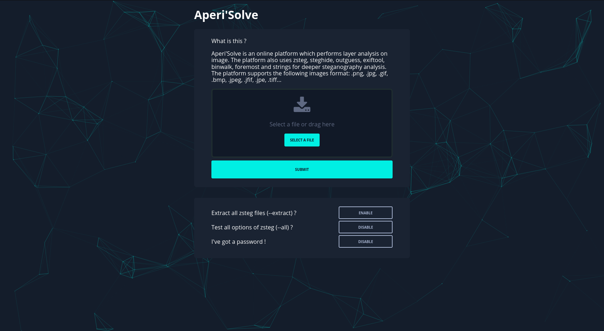

# Aperi'Solve
[](https://inventory.rawsec.ml/tools.html#Aperi'Solve)
[](https://aperisolve.fr/)
<p align="center"><a href="https://aperisolve.fr"></a></p>
<b>Try it now: https://aperisolve.fr</b>

# I . What is Aperi'Solve?
Aperi'Solve is an platform which performs layer analysis on image.<br/>
The platform also uses "*zsteg*", "*steghide*", "*exiftool*", "*binwalk*" and "*strings*" for deeper steganography analysis.
<p align="center"><a href="https://aperisolve.fr"></a></p>

# II . Why Aperi'Solve
Aperi'Solve has been created in order to have an "easy to use" platform which performs common steganalysis tests such as LSB or `steghide`. The platform and Dockerfile are also a quick alternative for people who didn't manage to install `zsteg` (ruby gem) properly.

# III . Features
Aperi'Solve is based on Python3 with Flask and PIL module, the platform currently support the following images format: `.png`, `.jpg`, `.gif`, `.bmp`, `.jpeg`, `.jfif`, `.jpe`, `.tiff`.

The platform allow you to:
- **Visualise each bit layer** of each channel for a given image (ie. LSB of Red channel).
- **Browse** and **Download each bit layer image**.
- **Visualise `zsteg` informations** such as text encoded on LSB
- **Download `zsteg` files** such as mp3 encoded on LSB
- **Download `steghide` files** using a defined password
- **Visualise `exiftool` informations** such as geolocation or author
- **Visualise `binwalk` informations**
- **Download `binwalk` files** such as zip in png headers
- **Visualise `strings` output**

# IV . Application
The Aperi'Solve platform is a *Flask* (python 3.7) application. The source code is located into the `/data` folder. The platform has been split as follows:
- *app.py* : Contain web routes and main application variables
- *stega.py* : Contain steganography functions. Layer decomposition is performed with numpy.
- *appfunct.py* : Contain functions used in both *app.py* and *stega.py*.
- */templates* : index.html (html view)
- */static* : Images, JavaScript and CSS
- */uploads* : Uploaded images and working directory for steganography tools

# V . Installation with Docker
A Dockerfile if provided in `/build/flask` and a `docker-compose.yml` is available at root directory.

1. Download the repository:
```bash
git clone https://github.com/Zeecka/AperiSolve.git
```

2. Configure docker-compose.yml **if needed** (ie. change `APP_PORT=80` to `APP_PORT=8888` if port `80` is already used).

3. Pull, Build, Run:
```bash
docker-compose pull
docker-compose build
docker-compose up
```

4. Access to the web platform and enjoy ! (usually `http://localhost/`)

# VI . Manual Installation (not recommanded)

As said in the beginning of this file, some of theses tools such as zsteg and exiftool may not be easy to install. Aperi'Solve has been created to package installation in docker container / provide a web access to the platform. If you still want to install the dependencies by yourself, here are the requirements:

- Install python and pip (version 3.7+)
```bash
apt install python3-dev
```
- Install python requirements (PIL, Numpy, ...):
```bash
cd build/flask/
pip3 install -r requirements
```
- Install `ruby` and `ruby-dev`:
```bash
apt install ruby ruby-dev
```
- Install `zsteg`:
```bash
gem install zsteg --no-ri --no-rdoc
```
- Install `steghide`:
```bash
apt install steghide
```
- Install `exiftool`:
```bash
apt install perl libimage-exiftool-perl
```
- Install `7z`:
```bash
apt install p7zip
```

Then, run:
```bash
python3 app.py
```

# TODO
- Implement Foremost ?
- Implement PNGcheck ?
- Implement stegoVeritas ?
- ...
